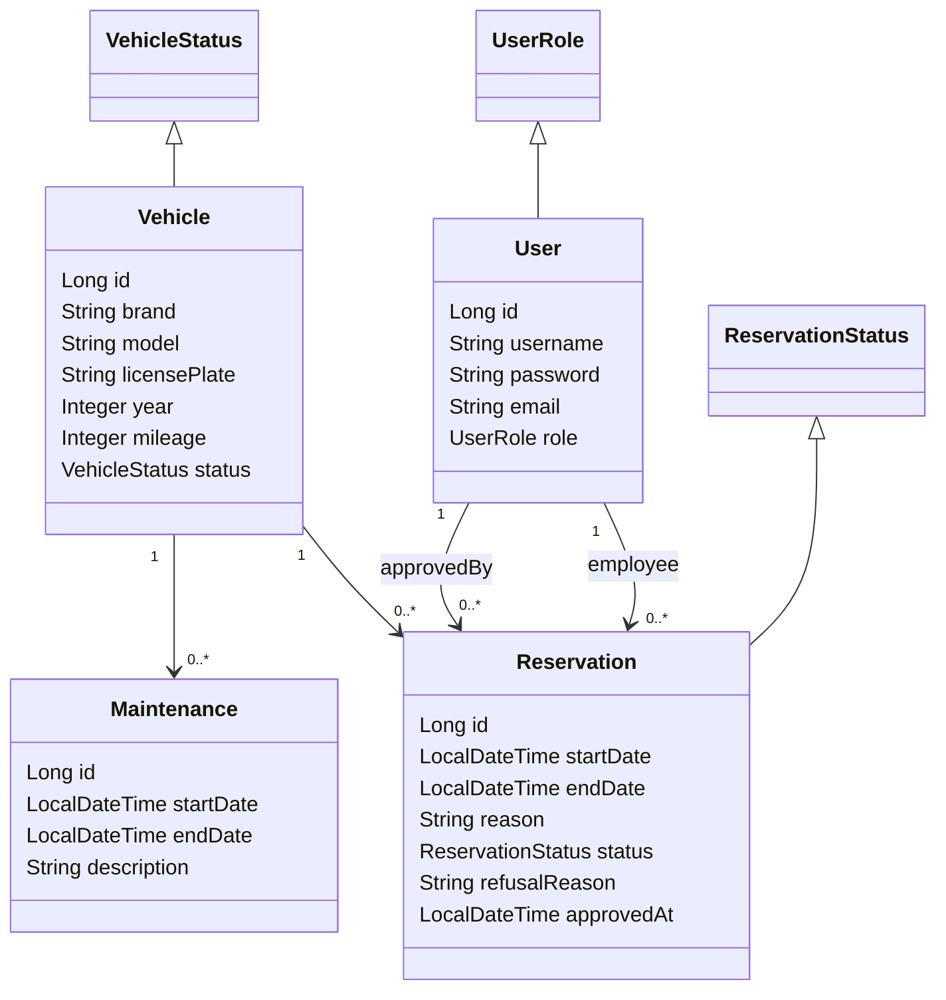

# Corporate Fleet Manager

Simple company vehicle management system.

## Features
- Employees: view available vehicles and make reservations
- Fleet manager: add/edit vehicles, approve bookings, record maintenance
- Two interfaces:
    - Back-office → Servlets + JSP
    - REST API → JAX-RS

## Main entities
- User (employee/manager)
- Vehicle
- Reservation
- Maintenance

## Technologies
- Jakarta EE 10
- WildFly
- Oracle Database
- Hibernate + Maven
- Servlet/JSP + JAX-RS

## Class diagram



## Local Development Setup (Docker)

To run and test the application locally (identical to school environment):

```bash
# 1. Clone the project
git clone https://github.com/SafouaneHaddadi/corporate-fleet-manager.git
cd corporate-fleet-manager

# 2. A script is provided to handle everything in one command:

# Make it executable (only once)
chmod +x redeploy.sh

# First launch OR after code changes → just run:
./redeploy.sh

# 3. Access the application
http://localhost:8180/
```

### Database connection (for manual queries)

To connect to the Oracle database:
```bash
docker exec -it oracle-local sqlplus ORA53/oracle@localhost:1521/FREEPDB1
```
### Recommended: Graphical tool (DBeaver or Oracle SQL Developer)

For a much better experience than the command line (colored tables, easy data browsing, auto-completion, etc.), use a graphical tool:

**DBeaver (free and recommended):**
1. Download: https://dbeaver.io/download/
2. New connection → Oracle
3. Connection settings:
    - Host: `localhost`
    - Port: `15210` (important! your docker-compose maps 15210 → 1521)
    - Service name: `FREEPDB1`
    - Username: `ORA53`
    - Password: `oracle`
    - Authentication: Native
4. Test connection → Save

**Oracle SQL Developer (free alternative):**
1. Download: https://www.oracle.com/tools/downloads/sqldev-downloads.html
2. New connection:
    - Connection type: Oracle - Thin
    - Hostname: `localhost`
    - Port: `15210`
    - Service name: `FREEPDB1`
    - Username: `ORA53`
    - Password: `oracle`

Your tables (`VEHICLES`, `RESERVATION`, `MAINTENANCE`, `APP_USER`) will appear under the schema `ORA53`.

## API Testing with Postman

**Quick setup:** Download `corporate-fleet-manager-complete.json` and import into Postman.

### Environment Variables
- `base_url`: `http://localhost:8180`
- `username`: `Alex` (manager) or `Sam`/`Arya` (employees)
- `password`: `alex123` or `sam123`/`arya123`
- `vehicle_id`: `7` (example)
- `reservation_id`: `29` (example)

### Test Users
- **Alex** - Manager - `alex123` - Full access
- **Sam** - Employee - `sam123` - Can create/view own reservations
- **Arya** - Employee - `arya123` - Can create/view own reservations

### API Endpoints

**Users:**
- `GET /api/users` (Manager only) - List all users
- `POST /api/users/register` (Public) - Register new user
- `POST /api/users/login` (Public) - User login
- `GET /api/users/me/reservations` (Employee only) - Get user's reservations

**Vehicles:**
- `GET /api/vehicles` (Manager only) - All vehicles
- `GET /api/vehicles/available` (Public) - Available vehicles
- `GET /api/vehicles/search?brand=audi` (Public) - Search by brand
- `GET /api/vehicles/{id}` - Vehicle details
- `POST /api/vehicles` (Manager only) - Create vehicle
- `PUT /api/vehicles/{id}` (Manager only) - Update vehicle
- `DELETE /api/vehicles/{id}` (Manager only) - Delete vehicle
- `GET /api/vehicles/{id}/reservations` (Manager only) - Vehicle reservation history

**Reservations:**
- `GET /api/reservations` (Manager only) - All reservations
- `GET /api/reservations/search?status=PENDING` (Manager only) - Filter by status
- `POST /api/reservations` (Employee only) - Create reservation
- `PUT /api/reservations/{id}/approve` (Manager only) - Approve reservation
- `PUT /api/reservations/{id}/decline` (Manager only) - Decline reservation (requires reason)
- `PUT /api/reservations/{id}/cancel` (Manager only) - Cancel approved reservation

**Maintenance:**
- `GET /api/maintenances` (Manager only) - All maintenance records
- `POST /api/maintenances` (Manager only) - Schedule maintenance

### Authentication
The collection includes automatic Basic Auth setup. Each request gets:
`Authorization: Basic [base64(username:password)]`

### Testing Tips
1. Start with Alex (manager) to test all endpoints
2. Switch to Sam/Arya to test employee permissions
3. Update IDs based on your actual database
4. Check Postman console for authentication logs

### Import Instructions
1. In Postman, click **Import**
2. Select `corporate-fleet-manager-complete.json`
3. Create environment with variables above
4. Select the environment from dropdown
5. Start testing!

The collection is ready-to-use with pre-configured requests and sample data.

## Context

**Academic project** for the "Applications Informatiques 3" course (Jakarta EE module) at HEPH-Condorcet.


